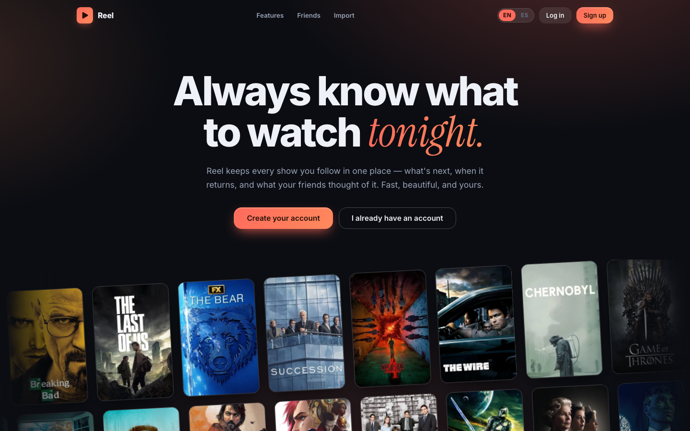

# Reel

**An invite-only TV tracker built for a small group of friends — live at [reel-app.com](https://reel-app.com).**

Reel replaced [TV Time](https://www.tvtime.com/) for our group when it shut down: what you're
watching, what's next tonight, when shows return, how everyone rated them — with your whole
history imported from TV Time's GDPR export.



## Features

- **Tonight** — what's next across everything you follow, one tap to mark watched.
- **Calendar** — upcoming episodes with real air *times* (TVmaze), shown in your timezone.
- **Ratings** — TMDB + IMDb scores per show and per episode, with a per-season episode graph
  (IMDb figures imported from IMDb's own published datasets — no scraping).
- **Friends** — activity feed with emoji reactions, taste-match %, per-friend comparison, stats.
- **Where to watch** — streaming providers for *your* country, not the show's US network.
- **Import / export** — one-shot import from a TV Time GDPR zip; full export of your own data anytime.
- **EN/ES**, installable PWA, invite-only signup.

## Stack

| Layer | Choice |
|---|---|
| Frontend | React + TypeScript (strict) + Vite, TanStack Query, zod on every boundary |
| Backend | Supabase — Postgres with RLS as the *only* authorization layer, Deno Edge Functions, pg_cron |
| Hosting | Cloudflare Workers (static assets + SPA fallback) |
| Email | Resend (magic links, daily digests) |
| CI / tests | vitest (~150 unit tests on pure domain logic), Playwright e2e against a full local Supabase stack — including an [RLS isolation spec](app/e2e/rls.spec.ts) — GitHub Actions |

## How it was built

The process is part of the repo, on purpose:

1. [DESIGN.md](DESIGN.md) — the product decisions, from a structured design interview.
2. [prototype/](prototype/) — a frozen UI prototype used to validate the design before the real build.
3. [docs/PLAN.md](docs/PLAN.md) + [docs/phases/](docs/phases/) — the build, specified commit-by-commit
   and executed in order (largely by a coding agent, under review), with `npm run check` green on every commit.
4. [docs/AUDIT-2026-07-12.md](docs/AUDIT-2026-07-12.md) — a 65-finding production-readiness audit run
   before the URL left my hands, and the fixes that came out of it.
5. [docs/ARCHITECTURE.md](docs/ARCHITECTURE.md) — stack, schema, RLS model and conventions;
   [docs/DEPLOY.md](docs/DEPLOY.md) and [docs/MIGRATION-CLOUDFLARE.md](docs/MIGRATION-CLOUDFLARE.md)
   are the operational runbooks.

## Running it locally

Prerequisites: Node 22+, Docker (running), and the [Supabase CLI](https://supabase.com/docs/guides/local-development).

```bash
# backend — from the repo root
supabase start               # boots the local stack (Postgres, Auth, functions)
supabase db reset            # applies migrations + a dev seed with demo users

# frontend
cd app
npm install
cp .env.example .env.local   # point it at the local stack (URL + anon key from `supabase status`)
npm run dev
```

The dev seed creates demo accounts (`cmo@example.com` / `password123`, plus two friends) and
open invite codes so every flow is walkable without real data. `npm run check`
(typecheck + lint + unit tests) is the gate CI runs on every push; `npm run test:e2e` drives
the Playwright suite against the local stack.

The production instance is invite-only and its API keys are not in this repo — see
[docs/DEPLOY.md](docs/DEPLOY.md) for what a real deployment needs.

## Data sources

This product uses the [TMDB](https://www.themoviedb.org/) API but is not endorsed or certified
by TMDB. Air times come from the [TVmaze](https://www.tvmaze.com/api) API (CC BY-SA). IMDb
ratings come from [IMDb's non-commercial datasets](https://developer.imdb.com/non-commercial-datasets/).

## License

[MIT](LICENSE)
